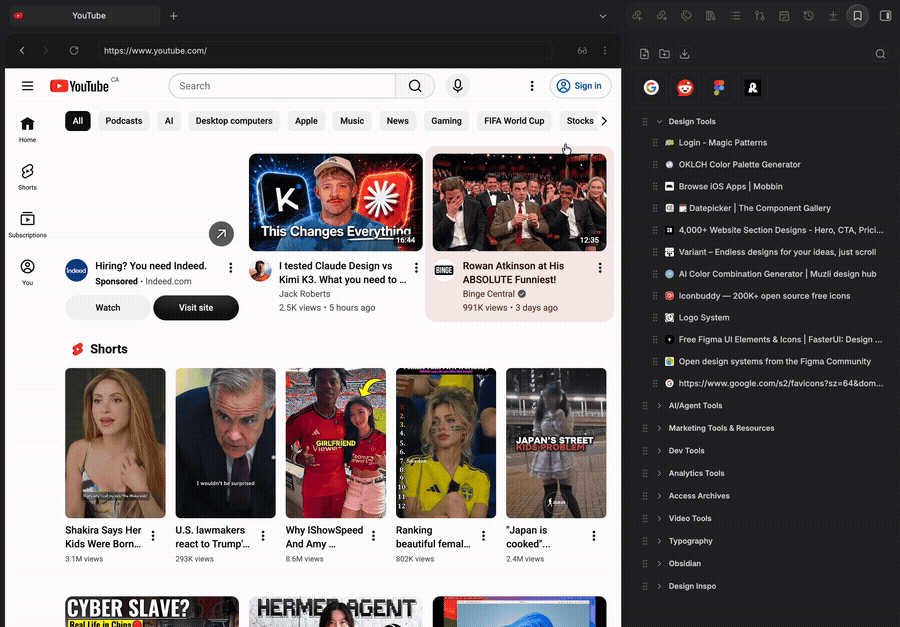

# Browser Bookmark

An independent bookmarks sidebar for Obsidian that opens saved links in Obsidian's own built-in Web Viewer, so browsing stays inside the app instead of handing off to your system browser.



## Why

Obsidian already ships a Web Viewer core plugin for reading links without leaving the app. This plugin is the bookmarks manager to go with it: a persistent sidebar panel that stays visible while you browse, rather than a bookmarks-and-browser hybrid that disappears the moment you click a link.

## Features

### Organizing bookmarks
- **Folders**, nested to any depth, with drag-and-drop reordering and re-filing (drag onto a folder to move something into it, drag between rows to reorder).
- **Search**: the search icon in the toolbar toggles a filter box; typing narrows the tree to matching bookmarks and auto-expands any folder containing a match.
- **Keyboard navigation**: click a row to focus it, then Arrow keys move up/down, Right/Left expand/collapse folders, Enter opens or toggles, F2 renames, Delete removes.
- **Real favicons** for every bookmark (with a plain globe icon fallback), toggleable in settings.
- **Duplicate-URL detection**: adding or editing a bookmark shows a non-blocking warning if that URL is already saved elsewhere.
- **Drag a link from a note** straight into the sidebar to bookmark it: onto a folder to file it there, or onto empty space to add it at the root.

### Pinned bookmarks
Right-click any bookmark → **Pin to top** to add it to a compact row of icon-only buttons above the tree (Arc-style). Drag to reorder; right-click → **Unpin** to send it back to the root of your tree. The row only appears once something's pinned; there's no empty placeholder.

### Opening bookmarks
Every bookmark opens in Obsidian's Web Viewer, as a new tab, a split pane, or a new window (set the default in settings, or override per-click from the right-click menu). If the Web Viewer core plugin is off, unavailable, or you're on mobile, it falls back to your system browser automatically.

### Importing bookmarks
Click the import icon in the toolbar:
- **From a browser export**: Chrome, Firefox, Safari, and Edge all export to the same standard HTML bookmarks format; pick that file and it imports directly.
- **From Arc**: no file picker needed. Arc has no standard export, so this reads its internal data file directly from the usual install location and imports your **pinned** items (Arc's "unpinned" tabs are closer to open/recent tabs than deliberate bookmarks, so those are left out by design).

Either way, you get a preview first, showing bookmark/folder counts, an editable destination folder name, and a list of what's about to be created, before anything is written. Everything lands in one new folder so an import never mixes into your existing bookmarks.

### Companion commands
- **Bookmark current web viewer page**: grabs the title/URL of whatever's open in the Web Viewer and prefills the add-bookmark dialog.
- **Intercept external links in notes** (optional, off by default): clicking an external link in a note opens it in the Web Viewer instead of your system browser.

## Settings

| Setting | Description |
|---|---|
| Open bookmarks in | Where a click opens the Web Viewer: new tab, split pane, or new window |
| Intercept external links in notes | Route external link clicks in notes through the Web Viewer |
| Show favicons | Turn off to always show a plain globe icon instead |
| Show ribbon icon | Show/hide the ribbon icon that opens the sidebar |

## Installation

### Manual installation
1. Download `main.js`, `manifest.json`, and `styles.css` from the [Releases](https://github.com/NoteNerdOfficial/browser-bookmark/releases) page.
2. Create a folder named `browser-bookmark` inside `.obsidian/plugins/` in your vault.
3. Place the downloaded files into that folder.
4. Reload Obsidian and enable **Browser Bookmark** in Community plugins.
5. Also enable Obsidian's core **Web viewer** plugin (Settings → Core plugins) so there's something for bookmarks to open into.

## Development

```bash
npm install
npm run dev    # watch mode with source maps
npm run build  # production bundle
```

## License

MIT, see [LICENSE](LICENSE).
